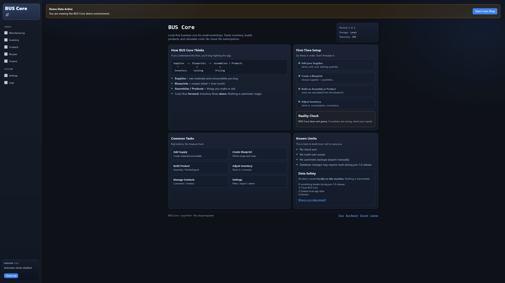
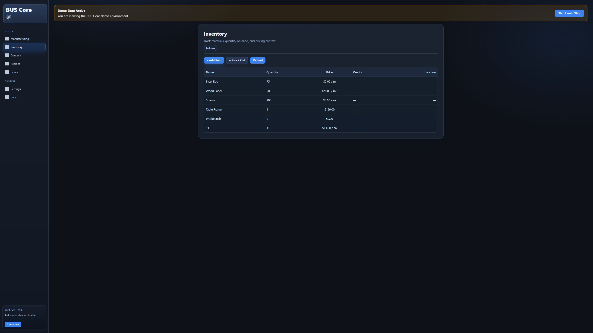
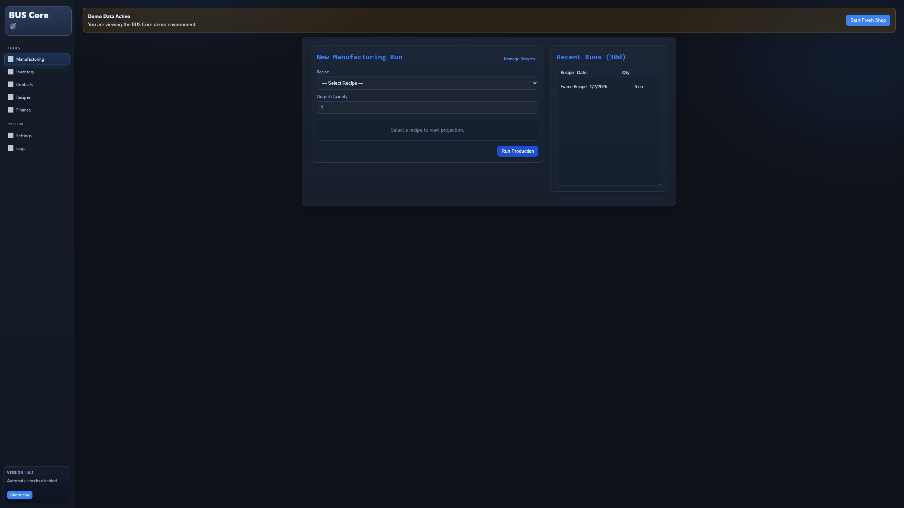
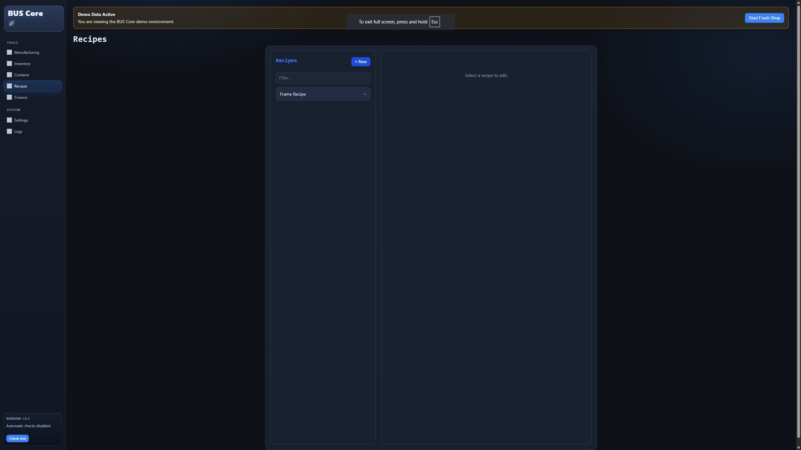
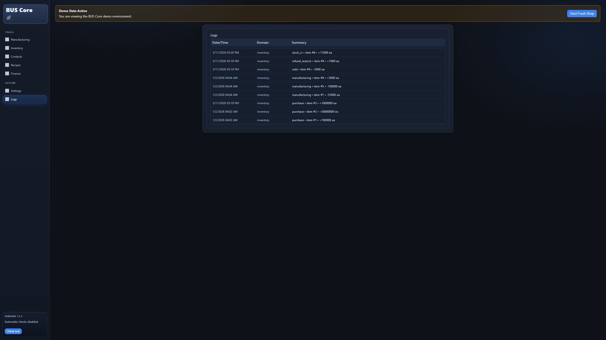
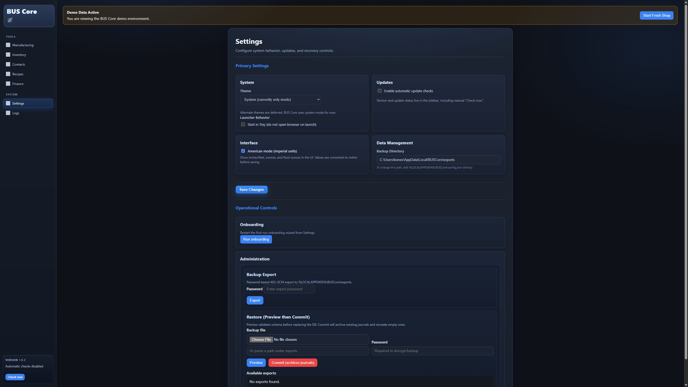

# TGC Business Utility System — BUS Core
[](https://buscore.ca/?src=github_readme_1)

Local-first. No accounts. No cloud. Runs offline.


A local-first inventory and manufacturing core for small shops that need durable control.


No cloud dependency. No accounts. No forced lock-in.  
Your data stays on your machine, and the system remains usable offline.


[](https://discord.gg/qp3rc5CxdM)
[](https://github.com/sponsors/truegoodcraft)


---

## What Is BUS Core?

BUS Core is the sovereign local system of record for workshops that build real things in small batches.

It is meant to be boring in the right ways: stable, predictable, reviewable, and fully usable on its own.

Core owns the canonical business logic, local data model, and operator-safe base workflows. Any Pro or companion tooling is additive around Core, not a prerequisite for using it.

It replaces:

- Spreadsheets
- Paper logs
- Ad-hoc tracking systems
- Expensive SaaS platforms

With:

- One local database
- Real production costing
- Full audit history
- Complete data ownership

It is built for operators who want control and continuity, not SaaS dependency.

---

## Who BUS Core Is For

- Small manufacturing shops
- Makerspaces
- Custom fabricators
- Repair and prototyping shops
- Solo operators

If you build physical products and want local authority over inventory, costing, and operating records, BUS Core is for you.


Use case example:
https://buscore.ca/use-cases/laser-engraving-shop/?src=github_readme_usecase


---

## What It Tracks

- **Materials & Consumables**  
  Track stock by unit (grams, millimeters, milliliters, each), with batch numbers, cost, and purchase dates.

- **Recipes**  
  Define how materials become products. Costs are calculated using FIFO from real purchase batches.

- **Assemblies & Products**  
  Build items from blueprints, set prices, and compare real costs to sales.

- **Vendors**  
  Track supplier pricing and purchasing history over time.

BUS Core focuses on operations and production costing.  
It is not a full accounting system—and is not trying to be.

---

## Key Features

- **Open Source Core** — AGPLv3-licensed local infrastructure
- **Precision Inventory** — FIFO batch valuation with metric units
- **Manufacturing Engine** — Recipe-based builds with atomic commits
- **Ledger & Audit Trail** — Complete movement history
- **Local & Private** — SQLite database with encrypted backups
- **Windows Native, Docker Optional** — Native Windows runtime, container support for other environments

---

## Getting Started

### Prerequisites

- Windows (primary support)
- Linux / macOS (supported via Docker)

---

## Installation (Windows)

1. Download the latest release.
2. Run the `.exe` file.
3. No installer required.

> Note: Windows Defender or SmartScreen may warn on first run. This repo does not currently guarantee automated code-signing for every Windows release.

The application runs in the **system tray**.  
Double-click the tray icon to open the dashboard.

---

## Development Mode

Enable development features by setting:

```bash
BUS_ENV=dev
```

This enables:

* Console output
* Debug endpoints
* Smoke tests (`scripts/smoke.ps1`)

Development scripts are included in the source tree.

---

## Architecture

See [`SOT.md`](SOT.md) for the canonical Source of Truth and system architecture.

---

## Interface Gallery

|                   Dashboard                   |                      Inventory                     |
| :-------------------------------------------: | :------------------------------------------------: |
|  |  |

|                      Manufacturing                     |                     Recipes                     |
| :----------------------------------------------------: | :---------------------------------------------: |
|  |  |

|                      Logs                     |                      Settings                     |
| :-------------------------------------------: | :-----------------------------------------------: |
|  |  |

---

## Run with Docker

```bash
docker compose up --build

# or, without Compose:
docker pull ghcr.io/true-good-craft/tgc-bus-core:latest
docker run -p 127.0.0.1:8765:8765 ghcr.io/true-good-craft/tgc-bus-core:latest
```

Docker is optional. Native Windows builds are supported.

Docker Compose defaults to loopback-only host publishing: `127.0.0.1:8765:8765`. BUS Core is local-first software; it is not safe for LAN or public exposure by default. The default session model is intended for local loopback use, not multi-user network hosting. Any non-loopback Docker deployment requires explicit operator action, a clearly separated override, and stronger access controls around the host, network, and `/session/token` bootstrap surface.


### Auto-Open Scripts

#### Windows

```powershell
scripts\up.ps1
```

#### macOS / Linux

```bash
./scripts/up.sh
```

### Health Check

```bash
curl http://localhost:8765/health
```

UI:

```
http://localhost:8765/ui/shell.html
```

### Stop

```bash
docker compose down
# or
docker rm -f bus-core
```

---

## Run Natively (Windows)

Docker is optional.

```powershell
pip install -r requirements.txt

python launcher.py
# or
.\Run Core.bat
```

`launcher.py` is the canonical native entry. It boots the canonical HTTP runtime from `core.api.http:create_app()` and opens `/ui/shell.html`.

UI:

```
http://localhost:8765/ui/shell.html
```

---
## Data & Persistence

* All data is stored locally in SQLite.
* Docker deployments persist data in `/data`.
* Default database path:

```bash
BUS_DB=/data/app.db
```

Backups can be encrypted using AES-GCM.

---

## Philosophy

BUS Core is built on three principles:

1. Local-first by default
2. Predictable, operator-safe behavior
3. User owns their data and operating continuity

Software for small shops should preserve trust, not manufacture dependency.

---

## Support BUS Core

BUS Core is supported through GitHub Sponsors and the BUS Core support page:

- GitHub Sponsors: https://github.com/sponsors/truegoodcraft
- BUS Core support: https://buscore.ca/support

---

## Security & Release Verification

BUS Core runs locally and does not require network access for normal use.

- Windows release builds are produced from `scripts/build_core.ps1` and `BUS-Core.spec`.
- `scripts/build_core.ps1` prints optional manual `signtool` commands, but this repo does not currently guarantee automated code-signing for every release.
- Update checks are default-on / opt-out. Fresh or missing update config runs one non-blocking startup check when `updates.enabled` and `updates.check_on_startup` are not explicitly `false`.
- Manual "Check now" remains available even when startup checks are disabled.
- BUS Core does not auto-download, auto-install, auto-stage on startup, or force restart.
- The sidebar "Update" button is manual and write-gated. It calls `/app/update/stage` only after the user clicks it.
- The update check path validates manifest URL policy, JSON/content type, payload size, strict SemVer, supported manifest shapes, configured channel selection, optional signed-manifest unwrapping, and optional artifact metadata shape.
- Current manifests must remain backward-compatible for deployed clients by keeping top-level `latest.version` and `latest.download.url`; new clients can additionally read `channels.<channel>`, additive metadata, and the top-level embedded Ed25519 `signature`.
- The release mirror signs the public manifest before upload using a private key stored outside the repo in GitHub secret `BUSCORE_MANIFEST_SIGNING_PRIVATE_KEY`; the matching public key is pinned in Core as `bus-core-prod-ed25519-2026-04-25`.
- Manual update staging now requires trusted signed manifests. Read-only `/app/update/check` still preserves unsigned-manifest compatibility for discovery.
- `/app/update/stage` runs the trusted manual staging chain: signed release selection, hash-verified ZIP download, safe extraction, EXE Authenticode plus True Good Craft signer checks with pinned thumbprint, and conservative `verified_ready` promotion.
- `/app/update/check` remains read-only and does not stage or launch artifacts.
- BUS Core does not overwrite the running EXE. After successful staging, the launcher can hand off on next start (after DB ownership lock) using configured verified launch policy.
- Channel support exists in Core config for `stable`, `test`, `partner-3dque`, `lts-1.1`, and `security-hotfix`, but current release automation publishes the stable manifest lane only.
- BUS Core has DB/app ownership locking to prevent two live owners of the same DB/app root.
- Docker is a separate deployment lane. Docker Compose publishes the app to host loopback only by default; the container-internal Uvicorn bind remains `0.0.0.0` so Docker networking works. Current GHCR images are tagged `latest` and commit SHA only; there are no SemVer image tags, image signatures, SBOM/provenance artifacts, image scans, or formal Docker update policy yet.
- Builds remain reproducible from source.

Note: Windows Defender or SmartScreen warnings may appear for new releases, especially when a binary is unsigned or has not yet built reputation.

## License

BUS Core is licensed under the GNU AGPLv3.

You are free to use, modify, and self-host it.
If you offer it as a network service, you must provide source access.

See `LICENSE` for details.

[https://buscore.ca](https://buscore.ca/?src=github_readme_1)

Maintained by True Good Craft (Canada)


